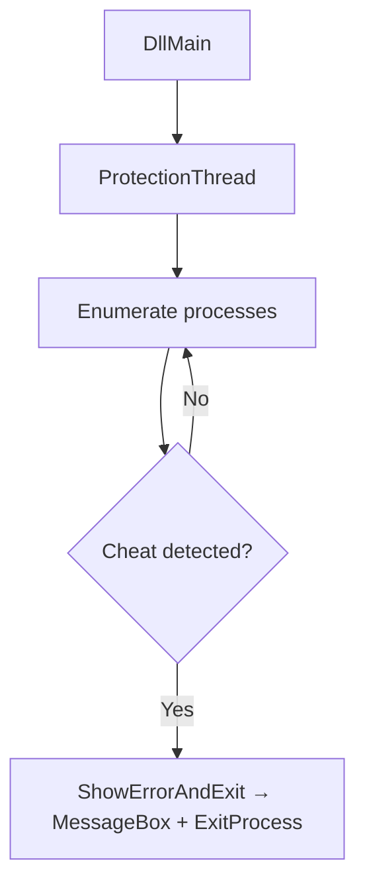

# PoringProtect
[](https://github.com/projectbaluga/PoringProtect/blob/main/LICENSE)
[](https://github.com/projectbaluga/PoringProtect/stargazers)
[](https://github.com/projectbaluga/PoringProtect/issues)
[](https://github.com/projectbaluga/PoringProtect/pulls)
[](https://github.com/projectbaluga/PoringProtect/commits/main)
[](https://github.com/projectbaluga/PoringProtect)

Lightweight anti-cheat DLL for Ragnarok Online clients.

## Table of Contents
- [Overview](#overview--what-it-does)
- [Architecture](#architecture-at-a-glance)
- [Getting Started](#getting-started)
- [Configuration](#configuration)
- [Usage](#usage)
- [Examples & Recipes](#examples--recipes)
- [Deployment](#deployment)
- [Testing & Quality](#testing--quality)
- [Performance & Security Notes](#performance--security-notes)
- [Roadmap](#roadmap)
- [Known Issues / What needs to be addressed](#known-issues--what-needs-to-be-addressed)
- [Contributing](#contributing)
- [FAQ](#faq)
- [License](#license)
- [Acknowledgments](#acknowledgments--credits)

## Overview / What it does
PoringProtect scans running processes and immediately terminates the game if a known cheat tool is detected.  
**Target users:** RagnaPH server maintainers and Ragnarok Online mod developers.

**Features**
- Monitors running processes, window titles, loaded modules, and executable contents.
- Configurable lists of banned executables and memory signatures.
- Displays a blocking dialog and exits the game when a cheat is found.

## Architecture at a glance
The project builds a Windows DLL (`PoringProtect.dll`). When injected into the game process, `DllMain` spawns a protection thread that repeatedly enumerates all processes. Each process is checked against:
1. File signatures (string patterns inside the EXE).
2. Executable name.
3. Window titles owned by the process.
4. Loaded modules.

If any check matches a banned entry, the DLL spawns a thread that shows an error message and terminates the host process.



## Getting Started
### Prerequisites
- Windows 10 or later
- Visual Studio 2022 (v17) with MSVC v143 toolset
- Windows 10 SDK

### Installation
```powershell
git clone https://github.com/projectbaluga/PoringProtect.git
cd PoringProtect
```

### Quick Start
1. Open `PoringProtect.sln` in Visual Studio.
2. Select `Release | x64` (or desired configuration).
3. Build the solution (`Ctrl+Shift+B`).
4. Copy `PoringProtect.dll` from `PoringProtect/x64/Release/` to your game directory.
5. Launch the game—PoringProtect now monitors for cheat tools.

## Configuration
| Name | Required | Default | Description |
|------|----------|---------|-------------|
| N/A  | –        | –       | No runtime environment variables.

Example `.env` (reserved for future use):
```env
# No variables currently required
```

Banned process names, window titles, modules, and memory patterns are defined directly in [`dllmain.cpp`](./PoringProtect/dllmain.cpp).

## Usage
- **Modify banned executables**  
  Edit the `bannedExes` array in `dllmain.cpp`, rebuild, and redistribute the DLL.
- **Adjust scan interval**  
  Change the `Sleep(5000);` call in `ProtectionThread` to a different value.
- **Add memory signature checks**  
  Append strings to `bannedMemPatterns`.

## Examples & Recipes
1. **Add a new cheat executable**
   ```cpp
   static const wchar_t* bannedExes[] = {
       L"cheatengine.exe",
       L"newcheat.exe" // ← add here
   };
   ```
2. **Increase scan frequency**
   ```cpp
   // From 5 seconds to 1 second
   Sleep(1000);
   ```
3. **Customize the error message**
   Replace the string inside `ShowErrorAndExit` before rebuilding.

## Deployment
### Local
- Build using Visual Studio or `msbuild PoringProtect.sln`.
- Place the resulting DLL beside the game executable.

### Production
- Distribute the DLL through your patcher or installer.
- Ensure only signed copies are distributed.
- Maintain an internal process for updating banned lists.

### Migrations, Seeding, Secrets
- Not applicable; the DLL contains no persistent data.

## Testing & Quality
- No automated tests currently.
- Manual QA: build the DLL and verify it blocks known cheat tools.
- Recommended: run static analysis (`/W4` or `/analyze`) in Visual Studio.

## Performance & Security Notes
- Scans run every 5 seconds; adjust if CPU impact is noticeable.
- Uses `PROCESS_QUERY_LIMITED_INFORMATION` to minimize required privileges.
- Lists are hard-coded; tampering requires rebuilding the DLL.
- No network or external services accessed.

## Roadmap
- External configuration for banned lists.
- Logging/audit trail for detections.
- Automated test suite and CI pipeline.
- Dynamic update mechanism for cheat signatures.
- Documentation for injecting the DLL into various launchers.
- Support for user-friendly configuration tool.
- Localization of messages.
- Optional telemetry for detection analytics.
- Configurable scan intervals.
- Packaging scripts for release automation.

## Known Issues / What needs to be addressed
- `resource1.h` referenced in the resource script is missing.
- No license file; distribution terms are unclear.
- Static lists require recompilation for updates.
- No CI or automated testing.
- Resource file path uses absolute Windows paths—hard to maintain cross-machines.

## Contributing
1. Fork and clone the repository.
2. Create a feature branch from `main`.
3. Follow standard Visual Studio C++ coding conventions.
4. Submit a pull request with a clear description and screenshots/logs when applicable.

No code of conduct is defined—please act professionally and respectfully.

## FAQ
**Q:** *Why does the build fail on older MSVC versions?*  
**A:** The project targets toolset v143; install Visual Studio 2022.

**Q:** *Will this run on Linux or macOS?*  
**A:** No. The code uses Windows-specific APIs.

**Q:** *How do I add new cheats to block?*  
**A:** Edit arrays such as `bannedExes` in `dllmain.cpp` and rebuild.

**Q:** *The game exits immediately on launch—what happened?*  
**A:** A detected tool triggered `ShowErrorAndExit`; verify no banned processes are running.

**Q:** *Can I change the scan frequency?*  
**A:** Yes, modify the sleep interval in `ProtectionThread`.

## License
**Unlicensed** – no `LICENSE` file is present. All rights reserved by the original author(s).  
*Last updated: 20 Aug 2025 (UTC+8).* 

## Acknowledgments / Credits
- Project by the RagnaPH community and contributors.

