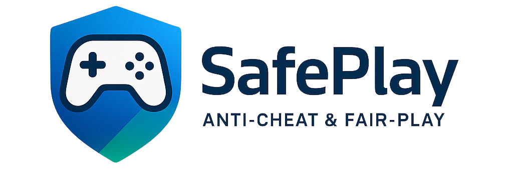

<p align="center">
  
</p>

[](#)
[](#)

## Overview
SafePlay is a lightweight Windows DLL designed to keep Ragnarok Online clients and other PC games fair. It injects into the
game process, provides a trusted client configuration, and continuously scans the system for known cheat tools.

A companion **SafePlay.exe** launcher is provided to start `RagnaPH.exe` from a trusted wrapper.

**Target Users:** Game developers, publishers, and server administrators who want to enforce fair play.

## How It Works
* **Embedded configuration** – `clientinfo.xml` is stored Base64-encoded in the DLL and is served from memory so the game
  always connects to the approved server settings.
* **Integrity check** – the library verifies that `Data.ini` contains the expected resource listing before starting.
* **API hooking** – kernel32 file APIs are patched via the Import Address Table to redirect file access to the in-memory
  configuration and to hide the virtual file handle.
* **Background protection thread** – every five seconds the DLL enumerates running processes and evaluates them against several
  detection vectors:
  - executable names on a banned list
  - suspicious window titles
  - loaded modules
  - static memory signatures (e.g. `4RTools`)
* **User feedback** – during startup a small non-blocking popup with a progress bar is displayed.
* When any banned tool is detected a message box identifies the offending program and the game is terminated.

## Building
1. Clone the repository:
   ```powershell
   git clone https://github.com/projectbaluga/SafePlay.git
   cd SafePlay
   ```
2. Open `SafePlay.sln` in Visual Studio 2022.
3. Build the `SafePlay` project to produce `SafePlay.dll`.
4. Place `SafePlay.dll` beside your game executable or inject it at runtime.

## Configuration
* Edit `data/clientinfo.xml` and encode it into `SafePlay/clientinfo.h` (Base64) to change the embedded server address, port,
  or other client settings.
* `Data.ini` must have `data.grf` as its first entry – the DLL validates this file before enabling protection.
* Extend the banned executable, window, module, or memory signature lists in `SafePlay/dllmain.cpp` to detect additional tools.

## Usage
Run `SafePlay.exe` to launch the game. The launcher sets a special
environment variable that `SafePlay.dll` checks during startup. If
`RagnaPH.exe` is executed directly the variable is missing, the DLL
displays an error, and the game terminates. This ensures the client
always starts through the protected launcher.

## Roadmap
- Cross-game compatibility
- External configuration file support
- Logging/audit trail
- Cloud-based signature updates
- Localization and user-friendly config tools
- CI/CD pipelines and automated tests

## License
This project is licensed under the [MIT License](LICENSE).

